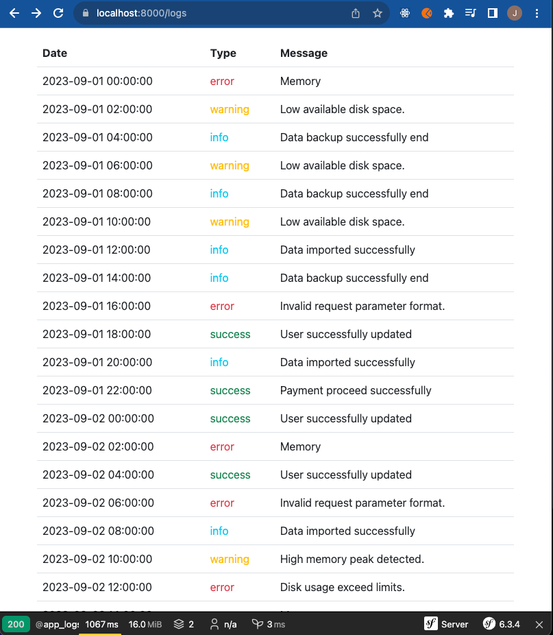

# Symfony TP PHPUnit

Le projet présente une mini application fictive de lecture de fichier de logs.

Vos missions sur le projet sont les suivantes:

 - Réaliser les tests unitaires de la classe LogTrace.
 - Les tests unitaires de la classe LogReaderService ont été réalisés, à l'aide de l'approche Test Driven development, vous devez implémenter ce service

Pour la réalisation des tests de la classe LogReaderService, un jeu de données de test est disponible dans le dossier /tests/data
## Démarrage du projet

### Exécuter la commade afin de générer le fichier de logs de l'application
`symfony console generate-logs`

## Preview du projet 

